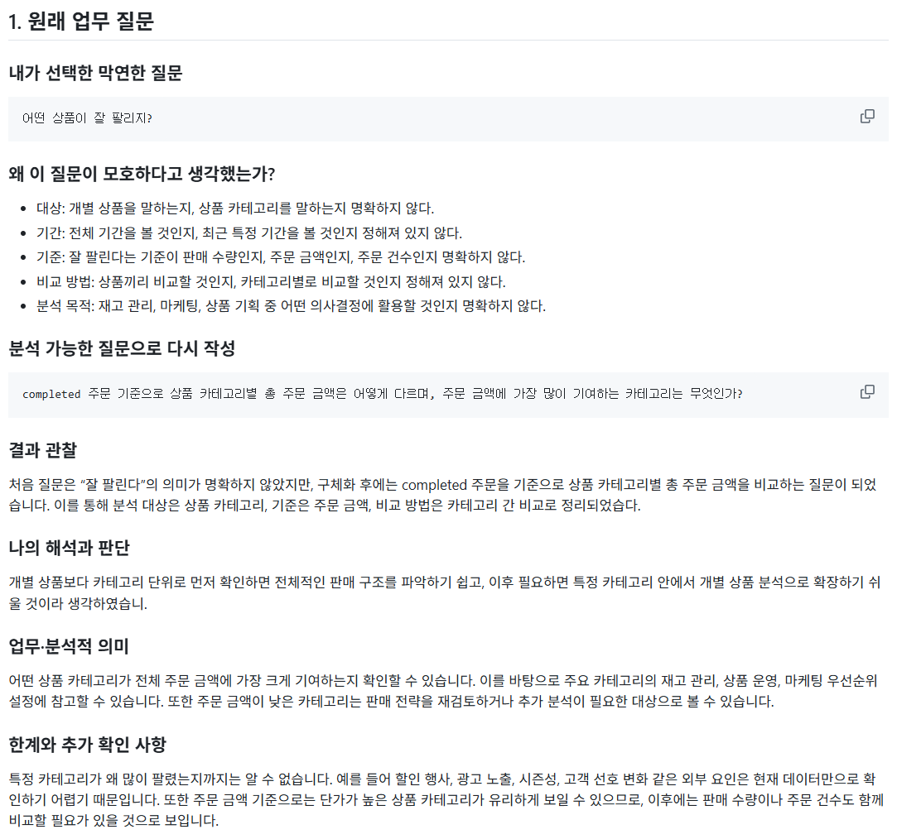
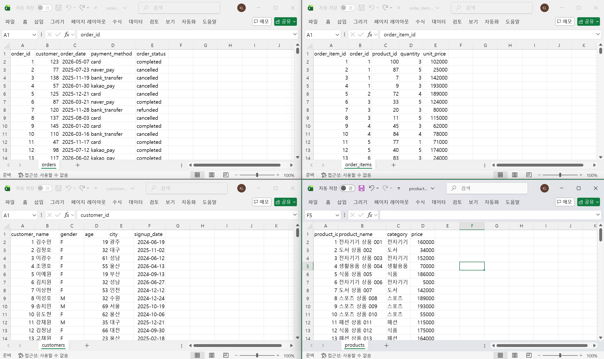
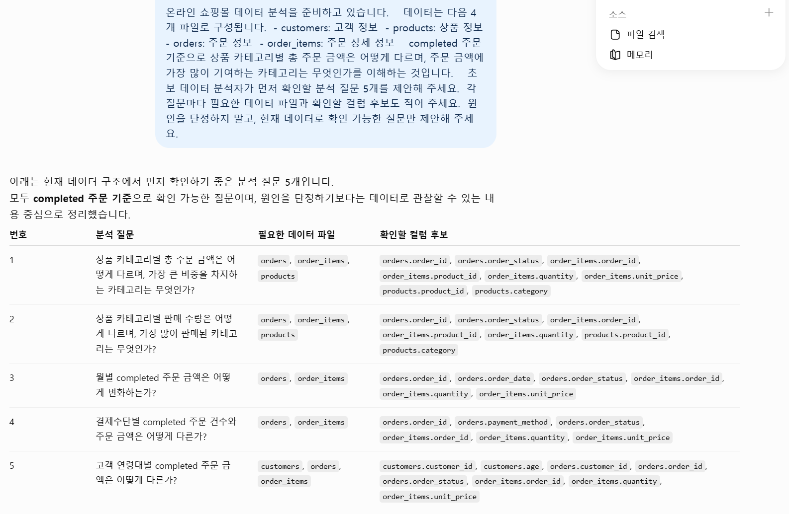
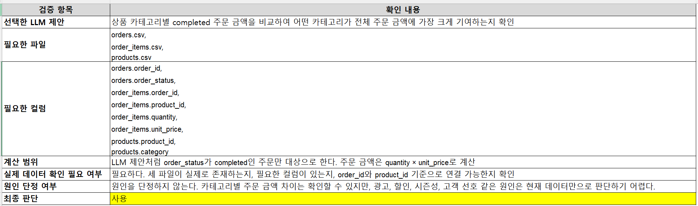
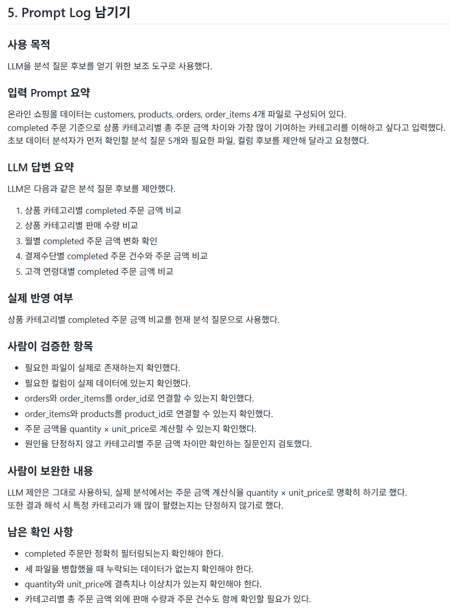
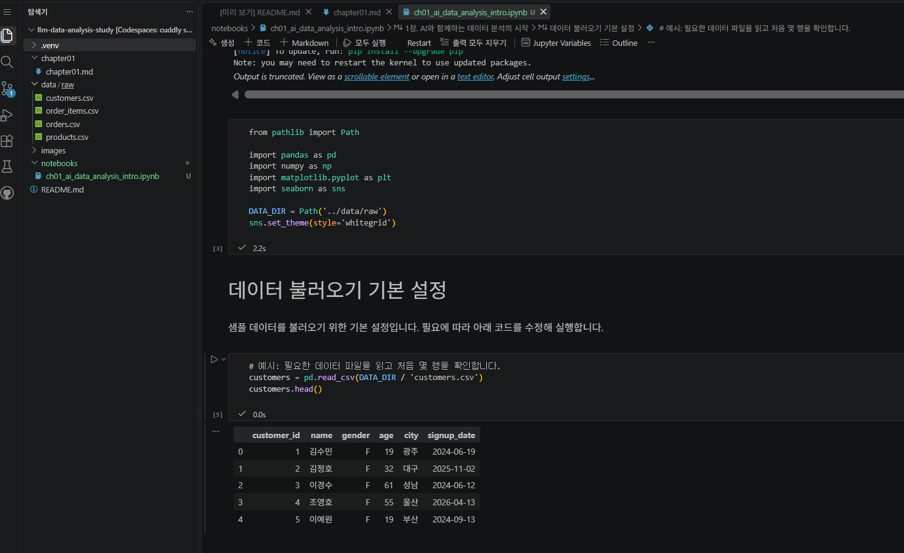

# Chapter 01 제출 답안. AI와 함께하는 데이터 분석의 시작

> 이 파일은 Chapter 01 실습 결과를 정리하여 제출하기 위한 학생용 템플릿입니다.  
> 강사 저장소의 원본 템플릿을 직접 수정하지 말고, 자신의 PC에 복사한 뒤 작성합니다.

---

## 0. 제출 정보

- 이름: `이경석`
- GitHub ID: `leeks2026`
- 개인 저장소명: `llm-data-analysis-study`
- 작성일: `20260906`
- 사용한 LLM: `ChatGPT`

### 최종 제출 URL

```text
https://github.com/leeks2026/llm-data-analysis-study/blob/main/chapter01/chapter01.md
```

---

## 1. 원래 업무 질문

### 내가 선택한 막연한 질문

```text
어떤 상품이 잘 팔리지?
```

### 왜 이 질문이 모호하다고 생각했는가?

- 대상: 개별 상품을 말하는지, 상품 카테고리를 말하는지 명확하지 않다.
- 기간: 전체 기간을 볼 것인지, 최근 특정 기간을 볼 것인지 정해져 있지 않다.
- 기준: 잘 팔린다는 기준이 판매 수량인지, 주문 금액인지, 주문 건수인지 명확하지 않다.
- 비교 방법: 상품끼리 비교할 것인지, 카테고리별로 비교할 것인지 정해져 있지 않다.
- 분석 목적: 재고 관리, 마케팅, 상품 기획 중 어떤 의사결정에 활용할 것인지 명확하지 않다.

### 분석 가능한 질문으로 다시 작성

```text
completed 주문 기준으로 상품 카테고리별 총 주문 금액은 어떻게 다르며, 주문 금액에 가장 많이 기여하는 카테고리는 무엇인가?
```

### 결과 관찰

처음 질문은 “잘 팔린다”의 의미가 명확하지 않았지만, 
구체화 후에는 completed 주문을 기준으로 상품 카테고리별 총 주문 금액을 비교하는 질문이 되었습니다.
이를 통해 분석 대상은 상품 카테고리, 기준은 주문 금액, 비교 방법은 카테고리 간 비교로 정리되었습다.

### 나의 해석과 판단

개별 상품보다 카테고리 단위로 먼저 확인하면 전체적인 판매 구조를 파악하기 쉽고, 이후 필요하면 특정 카테고리 안에서 개별 상품 분석으로 확장하기 쉬울 것이라 생각하였습니.

### 업무·분석적 의미

어떤 상품 카테고리가 전체 주문 금액에 가장 크게 기여하는지 확인할 수 있습니다.
이를 바탕으로 주요 카테고리의 재고 관리, 상품 운영, 마케팅 우선순위 설정에 참고할 수 있습니다.
또한 주문 금액이 낮은 카테고리는 판매 전략을 재검토하거나 추가 분석이 필요한 대상으로 볼 수 있습니다.

### 한계와 추가 확인 사항

특정 카테고리가 왜 많이 팔렸는지까지는 알 수 없습니다.
예를 들어 할인 행사, 광고 노출, 시즌성, 고객 선호 변화 같은 외부 요인은 현재 데이터만으로 확인하기 어렵기 때문입니다.
또한 주문 금액 기준으로는 단가가 높은 상품 카테고리가 유리하게 보일 수 있으므로, 이후에는 판매 수량이나 주문 건수도 함께 비교할 필요가 있을 것으로 보입니다.

### Evidence



---

## 2. 질문과 필요한 데이터 연결

### 필요한 데이터 파일

- [ ] `customers.csv`
- [ ] `products.csv`
- [ ] `orders.csv`
- [ ] `order_items.csv`

### 필요한 컬럼 후보

| 파일 | 필요한 컬럼 | 필요한 이유 |
| orders.csv | order_id | 주문 상세 데이터와 연결하기 위한 키 |
| orders.csv | order_status | completed 주문만 필터링하기 위한 기준 |
| order_items.csv | order_id | 주문 정보와 연결하기 위한 키 |
| order_items.csv | product_id | 상품 정보와 연결하기 위한 키 |
| order_items.csv | quantity | 주문 금액 계산에 사용 |
| order_items.csv | unit_price | 주문 금액 계산에 사용 |
| products.csv | product_id | 주문 상세 데이터와 연결하기 위한 키 |
| products.csv | category | 상품 카테고리별로 집계하기 위한 기준 |

### 데이터 연결 관계

```text
orders.order_id
        ↓
order_items.order_id

order_items.product_id
        ↓
products.product_id
```

### 결과 관찰

현재 데이터는 주문 정보, 주문 상세 정보, 상품 정보가 분리되어 있습니다.
따라서 하나의 파일만으로는 카테고리별 주문 금액을 바로 알 수 없고, order_id와 product_id를 기준으로 파일을 연결해야 합니다.
또한 주문 상태가 여러 종류로 나뉘어 있으므로 전체 주문을 모두 포함하기보다 completed 주문만 기준으로 분석하는 것이 더 적절할 것 같습니다.

### 나의 해석과 판단

처음에는 “어떤 상품이 잘 팔리는가”라는 질문이었지만, 실제 데이터 구조를 확인한 결과 카테고리별 주문 금액을 기준으로 보는 것이 분석하기에 적합하다고 판단했습니다.
개별 상품 단위로 바로 분석할 수도 있지만, 먼저 카테고리 단위로 보면 전체 판매 구조를 더 쉽게 파악할 수 있습니다.
또한 cancelled나 refunded 주문까지 포함하면 실제 판매 성과를 왜곡할 수 있으므로 completed 주문만 사용하는 것이 타당하다고 보았습다.

### 업무·분석적 의미

카테고리별 총 주문 금액을 확인하면 어떤 상품군이 매출에 가장 크게 기여하는지 알 수 있습니다.
이는 재고 확보, 상품 구성, 마케팅 우선순위 설정에 참고할 수 있습니다.
예를 들어 특정 카테고리의 주문 금액이 높다면 해당 카테고리를 핵심 상품군으로 관리할 수 있고, 주문 금액이 낮은 카테고리는 판매 전략을 추가로 검토할 수 있습다.

### 한계와 추가 확인 사항

현재 데이터만으로는 특정 카테고리의 주문 금액이 높은 이유를 정확히 알 수 없습니다.
할인 행사, 광고 노출, 시즌성, 고객 유입 경로 같은 정보는 포함되어 있지 않기 때문입니다.
또한 주문 금액 기준 분석은 단가가 높은 카테고리에 유리할 수 있으므로, 이후에는 판매 수량, 주문 건수, 평균 주문 금액도 함께 확인할 필요가 있습니다.

### Evidence

필요한 경우 관계도 또는 데이터 파일 확인 화면을 첨부하세요.



---

## 3. LLM에게 분석 질문 후보 요청

### 사용 목적

```text
왜 LLM을 사용했는지 작성하세요.
```

### 사용한 Prompt

```text
여기에 실제 사용한 Prompt를 붙여 넣으세요.
단, 개인정보·API Key·Secret은 포함하지 마세요.
```

### LLM 답변 요약

LLM의 전체 답변을 그대로 복사하지 말고 핵심 제안 3~5개를 요약하세요.

1.
2.
3.
4.
5.

### 결과 관찰

LLM이 어떤 방향의 질문을 주로 제안했는지 사실 위주로 작성하세요.

### 나의 해석과 판단

좋았던 제안과 그대로 사용하기 어려운 제안을 구분해서 작성하세요.

### 업무·분석적 의미

LLM이 분석 시작 단계에서 어떤 도움을 줄 수 있다고 생각하는지 작성하세요.

### 한계와 추가 확인 사항

LLM 답변에서 실제 데이터로 검증해야 할 내용을 작성하세요.

### Evidence



---

## 4. LLM 제안 검증

LLM 제안 중 하나 이상을 선택해 검토합니다.

| 검증 항목 | 확인 내용 |
| --- | --- |
| 선택한 LLM 제안 |  |
| 필요한 파일 |  |
| 필요한 컬럼 |  |
| 계산 범위 |  |
| 실제 데이터 확인 필요 여부 |  |
| 원인 단정 여부 |  |
| 최종 판단 | 사용 / 수정 후 사용 / 보류 |

### 내가 수정한 내용

```text
LLM 제안을 수정했다면 무엇을 어떻게 바꿨는지 작성하세요.
```

### 결과 관찰

검증 과정에서 확인된 사실을 작성하세요.

### 나의 해석과 판단

왜 `사용 / 수정 후 사용 / 보류` 중 해당 결정을 내렸는지 작성하세요.

### 업무·분석적 의미

LLM 제안을 검증하지 않고 바로 사용하는 경우 어떤 문제가 생길 수 있는지 작성하세요.

### 한계와 추가 확인 사항

아직 실제 데이터로 검증하지 못한 부분을 명확히 작성하세요.

### Evidence



---

## 5. Prompt Log

- 사용 목적:
- 입력 Prompt 요약:
- LLM 답변 요약:
- 실제 반영 여부:
- 사람이 검증한 항목:
- 사람이 수정한 내용:
- 남은 확인 사항:

### 결과 관찰

LLM 사용 기록에서 어떤 의사결정 과정을 확인할 수 있는지 작성하세요.

### 나의 해석과 판단

Prompt Log를 남기는 것이 왜 필요한지 자신의 말로 작성하세요.

### Evidence



---

## 6. 개인정보와 Secret 보호 확인

다음 항목을 확인합니다.

- [ ] 실제 이름·이메일·전화번호 등 고객 개인정보를 Prompt에 사용하지 않았습니다.
- [ ] API Key를 코드나 Notebook에 직접 작성하지 않았습니다.
- [ ] `.env` 실제 내용을 캡처하거나 업로드하지 않았습니다.
- [ ] GitHub Token, 비밀번호, 내부 URL이 캡처에 보이지 않습니다.
- [ ] 제출 전 이미지까지 다시 확인했습니다.

### 나의 판단

이번 실습에서 어떤 정보는 LLM 또는 Public GitHub에 올리면 안 된다고 판단했는지 작성하세요.

---

## 7. Chapter 01 Notebook 확인

Notebook:

```text
notebooks/ch01_ai_data_analysis_intro.ipynb
```

### 내 환경 상태

- [ ] 아직 환경설정 전이라 Notebook 위치만 확인했습니다.
- [ ] 환경설정이 완료되어 Notebook을 직접 실행했습니다.

### 환경설정 완료 학생만 작성

#### 실행한 코드

```python
from pathlib import Path

import pandas as pd
import numpy as np
import matplotlib.pyplot as plt
import seaborn as sns

DATA_DIR = Path('../data/raw')
sns.set_theme(style='whitegrid')
```

#### 실행 결과

```text
오류 없이 실행되었는지 작성하세요.
```

#### 결과 관찰

실행 결과에서 확인한 사실을 작성하세요.

#### 나의 해석과 판단

현재 Notebook이 본격 분석이 아니라 starter scaffold라는 의미를 자신의 말로 설명하세요.

#### 한계와 추가 확인 사항

Chapter 02 또는 Chapter 03에서 추가로 확인해야 할 내용을 작성하세요.

#### Evidence



> 환경설정 전이라면 이 이미지는 생략할 수 있습니다.

---

## 8. Chapter 01 최종 해석

### 이번 장에서 가장 중요하다고 생각한 내용

```text
자신의 말로 3~5문장 작성하세요.
```

### LLM을 데이터 분석에 사용할 때 가장 조심해야 할 점

```text
자신의 판단을 작성하세요.
```

### 사람과 LLM의 역할 차이

| 항목 | LLM이 도울 수 있는 부분 | 사람이 책임져야 하는 부분 |
| --- | --- | --- |
| 질문 정의 |  |  |
| 데이터 확인 |  |  |
| 코드 작성 |  |  |
| 결과 해석 |  |  |
| 최종 판단 |  |  |

### 다음 Chapter에서 확인하고 싶은 것

```text
이번 장에서 남은 의문이나 Chapter 02~03에서 확인하고 싶은 내용을 작성하세요.
```

---

## 9. 최종 제출 체크리스트

- [ ] 원래 업무 질문과 구체화한 분석 질문을 작성했습니다.
- [ ] 질문에 필요한 데이터 파일과 컬럼 후보를 정리했습니다.
- [ ] LLM Prompt와 답변 요약을 작성했습니다.
- [ ] LLM 제안을 실제 데이터 관점에서 검증했습니다.
- [ ] 각 핵심 STEP의 결과 관찰을 작성했습니다.
- [ ] 각 핵심 STEP의 나의 해석과 판단을 작성했습니다.
- [ ] 업무·분석적 의미를 작성했습니다.
- [ ] 한계와 추가 확인 사항을 작성했습니다.
- [ ] 핵심 실행 Evidence 이미지를 첨부했습니다.
- [ ] 이미지가 Markdown에서 정상 표시됩니다.
- [ ] 개인정보가 없습니다.
- [ ] API Key·Secret·Token이 없습니다.
- [ ] 개인 GitHub 저장소에 업로드했습니다.
- [ ] GitHub에서 Markdown과 이미지가 정상 표시됩니다.
- [ ] 아래 최종 파일 URL이 정상적으로 열립니다.

### 최종 파일 URL

```text
https://github.com/<내-GitHub-ID>/llm-data-analysis-study/blob/main/chapter01/chapter01.md
```

---

## 10. 교수자 확인용 요약

### 수행 상태

- [ ] COMPLETE
- [ ] PARTIAL

### 내가 가장 중요하게 내린 판단 1개

```text
여기에 작성하세요.
```

### 아직 확인이 필요한 내용 1개

```text
여기에 작성하세요.
```