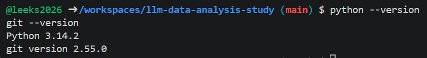
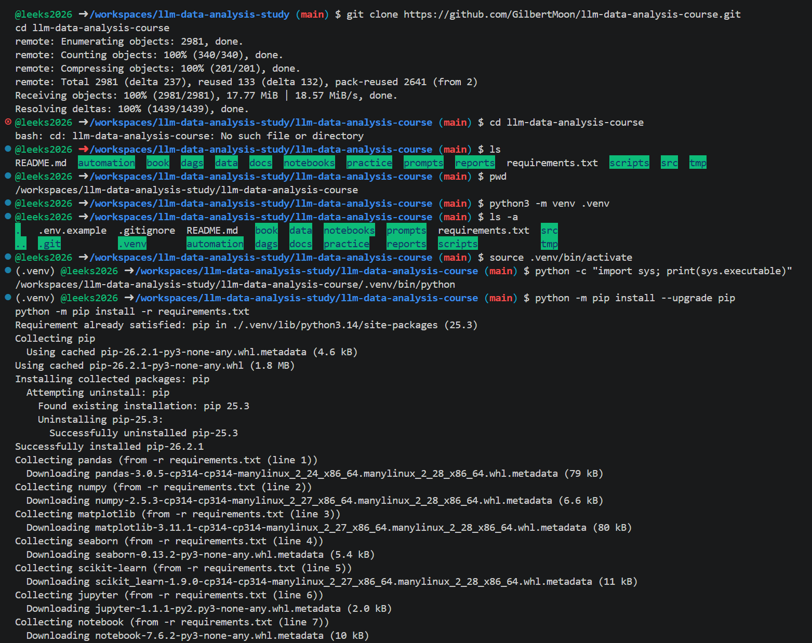
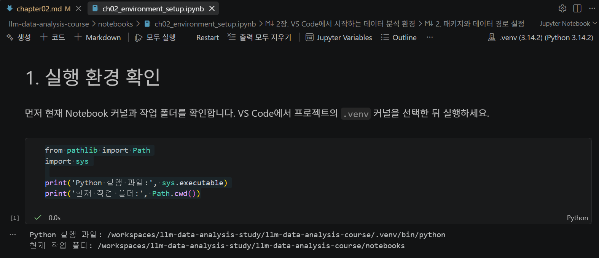
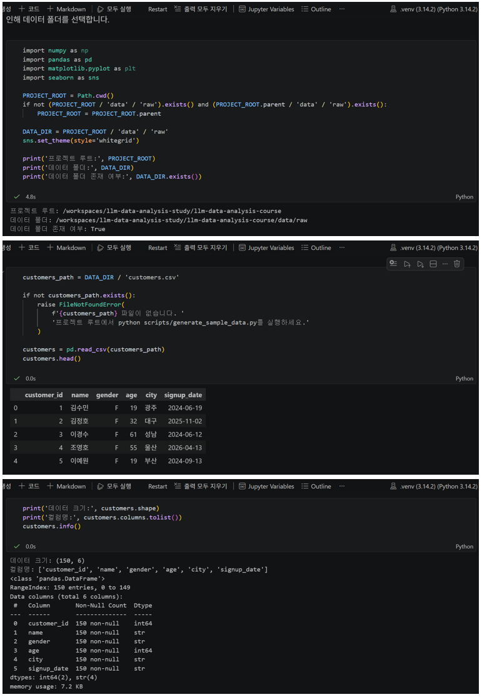
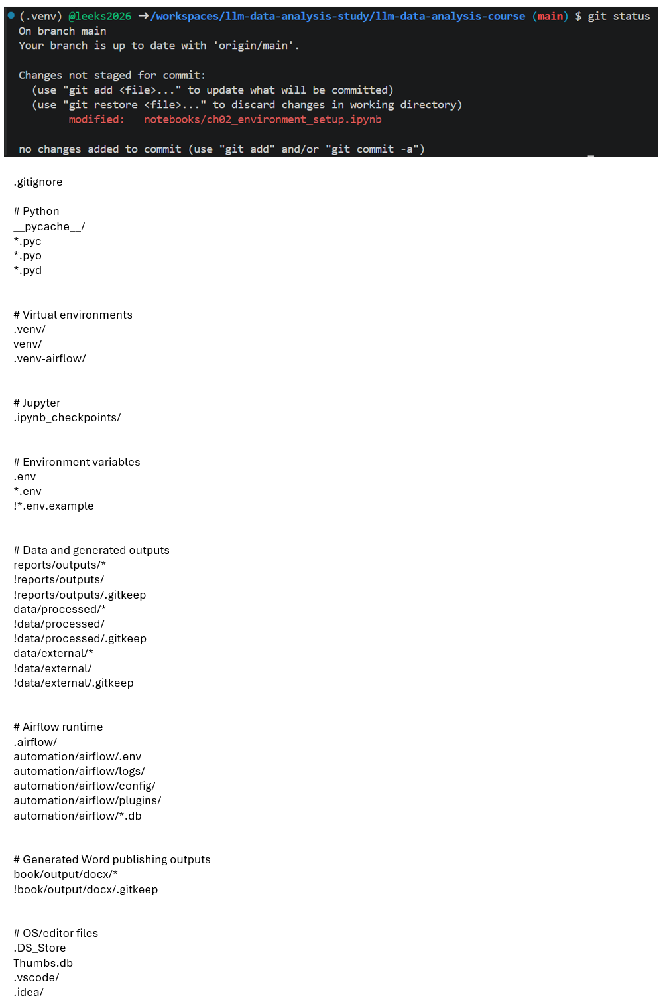

# Chapter 02 제출 답안. VS Code에서 시작하는 데이터 분석 환경

> 최종 파일은 개인 GitHub 저장소의 `chapter02/chapter02.md`로 저장하는 것을 권장합니다.

## 0. 제출 정보

- 이름: `이경석`
- GitHub ID: `leeks2026`
- 개인 저장소: `llm-data-analysis-study`
- 작성일: `20260910`
- 운영체제: `Codespaces (Linux)`

### 최종 제출 URL

```text
https://github.com/leeks2026/llm-data-analysis-study/blob/main/chapter02/chapter02.md
```

---

## 1. Python과 Git 환경 확인

### 실행 내용

```text
python --version
git --version
```

### 실행 결과

```text
Python 3.14.2
git version 2.55.0
```

### Evidence



### 결과 관찰

Python과 Git 버전이 정상적으로 출력되었다.
두 명령 모두 Codespaces 터미널에서 실행 가능했다.

### 나의 해석과 판단

Codespaces 환경에서 Python과 Git이 정상적으로 동작하므로 이후 단계로 진행할 수 있다고 판단했습니다.

### 업무·분석적 의미

버전을 확인하면 “내 환경에서 잘 돌아가는지” 미리 알 수 있어서, 
나중에 패키지를 설치하거나 저장소를 다룰 때 오류가 덜 생깁니다.
특히 Codespaces 같은 클라우드 환경은 로컬 PC랑 다를 수 있으니 처음에 꼭 확인하는 게 중요합니다.

### 한계와 추가 확인 사항

Codespaces에서는  커널 연결 문제나 작업 폴더 경로 문제가 생길 수 있으니 주의해야 합니다.

---

## 2. 저장소와 `.venv` 준비

### 수행 내용

- [x] 공식 Public 저장소 clone
- [x] 프로젝트 루트 확인
- [x] `.venv` 생성
- [x] `.venv` 활성화
- [x] `requirements.txt` 설치

### 핵심 실행 결과

```text
현재 프로젝트 경로: /workspaces/llm-data-analysis-study/llm-data-analysis-course
터미널 Python 실행 파일: /workspaces/llm-data-analysis-study/llm-data-analysis-course/.venv/bin/python
가상환경 활성화 여부: 터미널 앞에 (.venv) 표시됨
패키지 설치 결과: requirements.txt 패키지들이 정상적으로 설치됨
```

### Evidence



### 결과 관찰

터미널에서 .venv를 활성화했더니 앞에 (venv) 표시가 생겼습니다.

`python -c "import sys; print(sys.executable)"` 명령을 실행했더니  
경로가 `/workspaces/llm-data-analysis-study/llm-data-analysis-course/.venv/bin/python`으로 나왔습니다.  
즉, 지금 사용하는 Python이 내가 만든 `.venv` 가상환경 안에 있다는 걸 확인했습니다.

패키지 설치도 오류 없이 끝났습니다.

### 나의 해석과 판단

지금 사용하는 Python이 시스템 기본 Python이 아니라 내가 만든 .venv를 가리키고 있다는 걸 확인했습니다.
이렇게 분리해 두면 다른 프로젝트랑 패키지가 섞이지 않고, 이 프로젝트만의 환경을 유지할 수 있습니다.
그래서 앞으로 Notebook을 실행할 때도 패키지 충돌 같은 문제가 덜 생길 거라고 생각합니다.

### 업무·분석적 의미

가상환경을 쓰면 다른 사람도 같은 저장소를 clone해서 똑같은 환경을 만들 수 있습니다.
예를 들어 팀원이 내 저장소를 받아서 실행해도, .venv와 requirements.txt 덕분에 같은 버전의 패키지를 설치할 수 있습니다.
이렇게 하면 팀원간 호환성 문제가 줄어들고, 협업할 때 훨씬 편리합니다.

### 한계와 추가 확인 사항

지금은 Codespaces 환경이라 잘 되었지만, 회사나 기관 PC에서는 보안 정책 때문에 가상환경 활성화가 막힐 수도 있습니다.
또 Python 버전이 다르면 일부 패키지가 설치가 안 되거나 동작이 달라질 수 있습니다.
그래서 이후 단계에서 Notebook 커널이 .venv랑 정확히 연결되는지 꼭 확인해야 합니다.

---

## 3. VS Code 인터프리터와 Jupyter 커널 연결

### 확인 결과

```text
VS Code Python 인터프리터: /workspaces/llm-data-analysis-study/llm-data-analysis-course/.venv/bin/python
Notebook sys.executable: /workspaces/llm-data-analysis-study/llm-data-analysis-course/.venv/bin/python
Notebook Path.cwd(): /workspaces/llm-data-analysis-study/llm-data-analysis-course
```

### Evidence



### 결과 관찰

터미널에서 Python을 실행했을 때와 Notebook에서 Python을 실행했을 때, 둘 다 같은 .venv 가상환경을 가리키고 있음을 확인했습니다. 즉, 터미널과 Notebook이 같은 Python 환경을 사용하고 있습니다.

### 나의 해석과 판단

만약 터미널과 Notebook이 서로 다른 Python을 사용한다면, 터미널에서 설치한 패키지가 Notebook에서는 보이지 않아 오류가 날 수 있습니다. 예를 들어, 터미널에서 pandas를 설치했는데 Notebook에서는 Error가 뜨는 상황이 생길 수 있습니다. 그래서 두 환경을 꼭 맞춰야 합니다.

### 업무·분석적 의미

인터프리터와 커널을 같은 .venv로 맞추면, 패키지 설치와 실행 환경이 일관되게 유지됩니다. 이로 인해 환경 불일치로 인한 오류를 줄이고, 데이터 분석 실습이나 협업 시 내 환경에서는 되는데 다른 사람 환경에서는 안되는 문제를 예방할 수 있습니다.

### 한계와 추가 확인 사항

실제로 sys.executable을 출력해 .venv/bin/python을 가리키는지 확인해야 합니다.
Codespaces에서는 기본 Python 커널이 자동으로 선택될 수 있으므로, 매번 프로젝트별 .venv를 직접 선택하는 습관이 필요합니다.
Notebook 실행 위치(Path.cwd())가 프로젝트 루트가 아니라 다른 폴더를 가리키면 데이터 파일을 불러올 때 오류가 날 수 있으므로, 이 부분도 반드시 확인해야 합니다.

---

## 4. 샘플 데이터와 Notebook 실행 검증

### 확인 결과

```text
DATA_DIR 존재 여부: 존재함을 확인했습니다.
customers.csv 존재 여부: 존재함을 확인했습니다.
customers.shape: (150, 6)
주요 컬럼: ['customer_id', 'name', 'gender', 'age', 'city', 'signup_date']
```

### Evidence



### 결과 관찰

customers.head() 실행 결과 컬럼의 앞부분 값들이 정상적으로 표시되었습니다.
customers.shape 결과는 (150, 6) 행과 컬럼이 포함된 데이터임을 확인했습니다.
customers.columns 결과에서 주요 컬럼명이 정상적으로 출력되었습니다.
즉, 샘플 데이터가 정상적으로 불러와졌고 Notebook에서 실행이 잘 되고 있습니다.

### 나의 해석과 판단

이 단계까지 성공했다는 것은 가상환경(.venv), VS Code 인터프리터, Notebook 커널, 데이터 파일 경로가 모두 정상적으로 연결되어 있다는 뜻입니다. 즉, 환경 설정과 데이터 접근이 잘 되어 있어 이후 분석을 진행할 준비가 된 상태라고 판단할 수 있습니다.

### 업무·분석적 의미

분석 전에 이렇게 간단히 데이터를 불러와 shape와 컬럼을 확인하는 과정을 스모크 테스트(smoke test)라고 합니다. 이는 최소한의 실행 검증으로, 환경이 제대로 연결되었는지 빠르게 확인할 수 있습니다. 저 같은 초보자에게는 데이터가 잘 읽히는지만 확인해도 큰 의미가 있으며, 이후 본격적인 분석에서 환경 문제로 시간을 낭비하지 않게 해줍니다.

### 한계와 추가 확인 사항

현재는 데이터가 정상적으로 불러와졌다는 것만 확인했을 뿐, 데이터 품질(결측치, 이상치 등)은 아직 검증하지 않았습니다.
Notebook 실행 위치(Path.cwd())가 프로젝트 루트가 아니라 다른 폴더라면 파일을 못 읽을 수 있으므로, 항상 실행 위치를 확인해야 합니다.
샘플 데이터는 작은 크기라서 쉽게 불러올 수 있지만, 실제 업무에서는 대용량 데이터가 올 수 있으므로 추가적인 성능 검증도 필요합니다.

---

## 5. 오류 해결 기록

`해당 없음`

### 오류 메시지

```text
해당 없음
```

### 원인 후보

1. `해당 없음`
2. `해당 없음`
3. `해당 없음`

### 내가 확인한 순서

1. `해당 없음`
2. `해당 없음`
3. `해당 없음`

### 해결 방법

```text
해당 없음
```

### Evidence


### 나의 해석과 판단

`해당 없음`

### 한계와 추가 확인 사항

`해당 없음`

---

## 6. Secret 보호 확인

- [x] `.env`는 Git 추적 대상이 아닙니다.
- [x] 실제 API Key를 코드에 작성하지 않았습니다.
- [x] 캡처 화면에 Token/비밀번호가 없습니다.
- [x] `.venv`를 Git에 올리지 않습니다.

### Evidence

필요한 경우 `git status`, `.gitignore` 확인 화면을 첨부합니다.



### 나의 해석과 판단

환경 파일(.env)과 비밀정보(API Key, 비밀번호 등)를 코드와 분리해야 하는 이유는 
코드에 직접 Key나 비밀번호를 적으면, GitHub 같은 저장소에 올릴 때 외부에 노출될 수 있는 부분을 방지하고
여러 사람이 같은 프로젝트를 사용할 때, 각자의 Key를 따로 관리할 수 있어 충돌이나 유출 위험을 줄일 수 있습니다.
코드와 비밀정보를 분리하면, 개발 환경과 운영 환경에서 서로 다른 Key를 안전하게 적용할 수 있습니다.

---

## 7. Chapter 02 최종 회고

### 가장 중요했다고 생각한 환경 설정 1가지

```text
Notebook 커널을 내가 만든 .venv 가상환경으로 맞춘 것
```

### 그 이유

```text
터미널과 Notebook이 같은 Python 환경을 사용해야 패키지 설치와 실행이 일관되게 유지됩니다.
환경이 다르면 터미널에서는 되는데 Notebook에서는 오류가 나는 상황이 생기기 때문에,
커널을 올바르게 선택하는 것이 가장 중요한 설정이라고 판단했습니다.
```

### 다음 Chapter에서 재사용할 환경 체크 3가지

1. sys.executable로 Notebook이 사용하는 Python 실행 파일 확인
2. Path.cwd()로 현재 작업 폴더 확인
3. 샘플 데이터(customers.csv)를 불러와 shape와 컬럼 확

### 현재 환경의 한계 또는 주의점

```text
현재는 환경 연결과 데이터 로드만 확인했을 뿐, 데이터 품질(결측치, 이상치 등)은 아직 검증하지 않았습니다.
또한 Codespaces에서는 기본 커널이 자동으로 선택될 수 있으므로,
매번 내가 만든 .venv를 직접 선택하는 습관이 필요합니다.

```

---

## 최종 제출 체크

- [x] 핵심 Evidence 4~7장을 첨부했습니다.
- [x] 단순 캡처가 아니라 관찰과 판단을 작성했습니다.
- [x] Secret/개인정보가 없습니다.
- [x] GitHub에서 이미지가 정상 표시됩니다.
- [x] 개인 저장소에 `chapter02/chapter02.md`를 업로드했습니다.
- [x] 저장소 URL이 아니라 최종 파일 URL을 제출합니다.