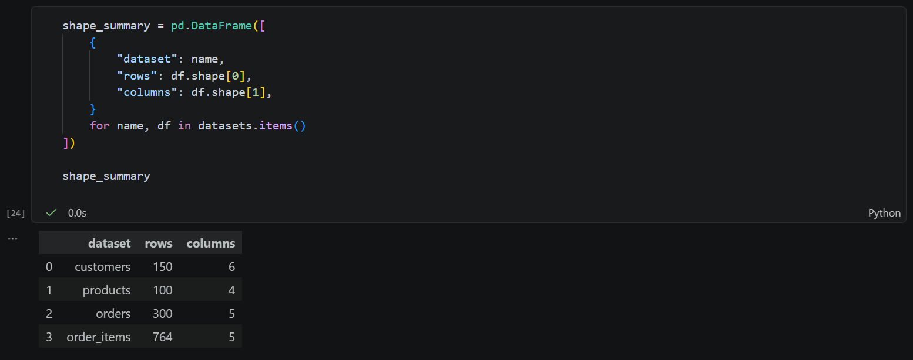
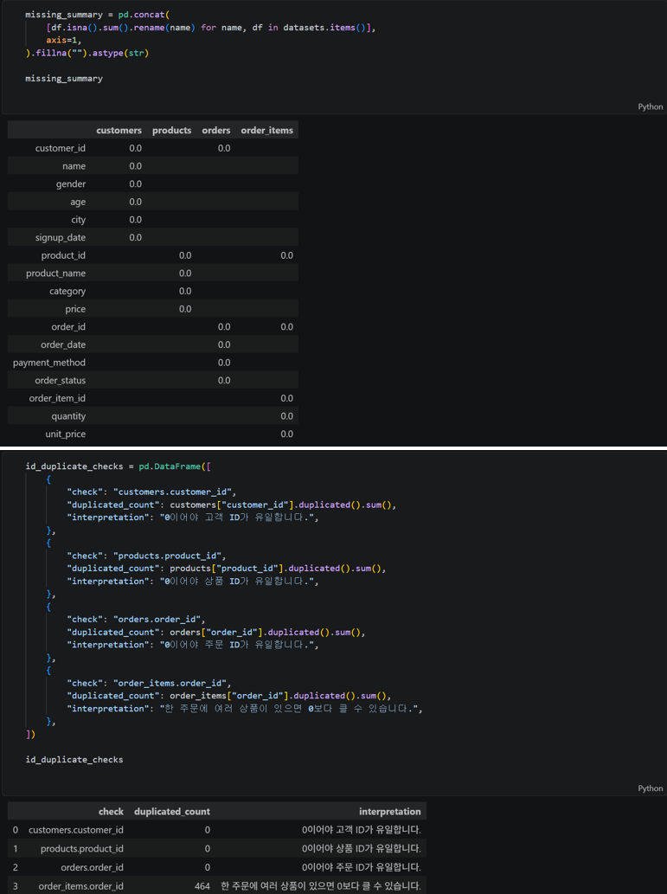
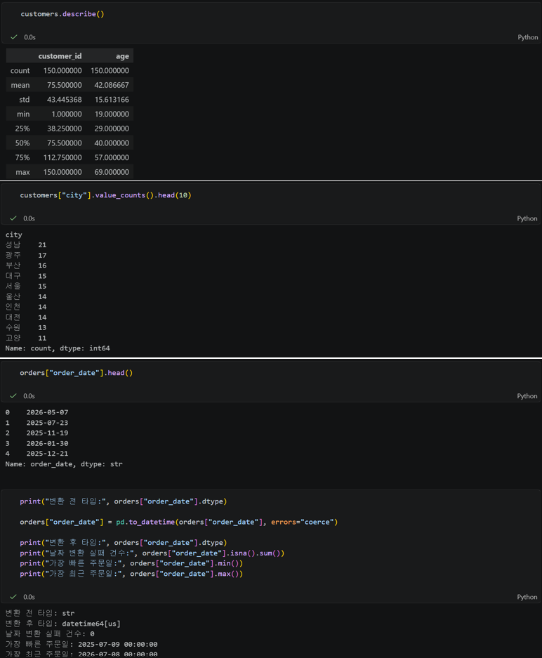
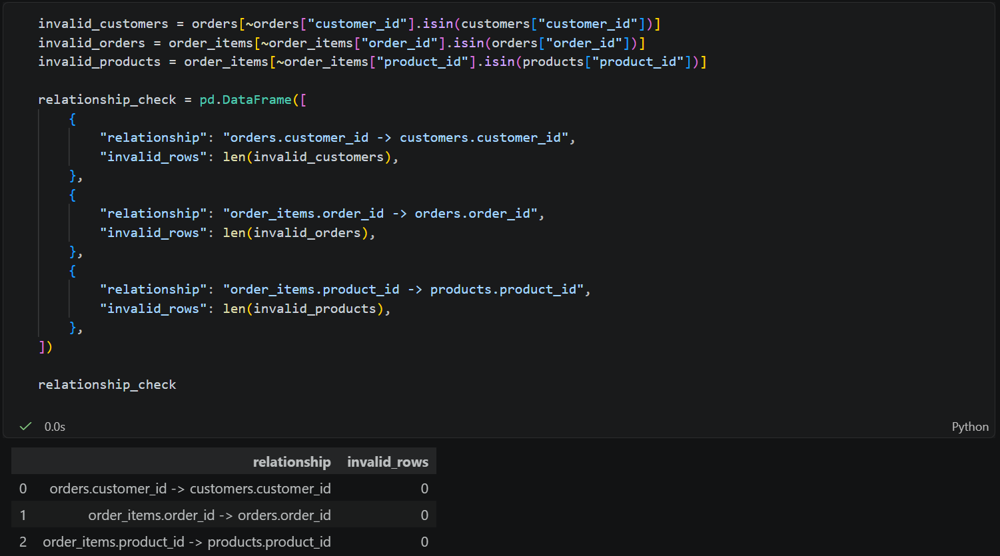
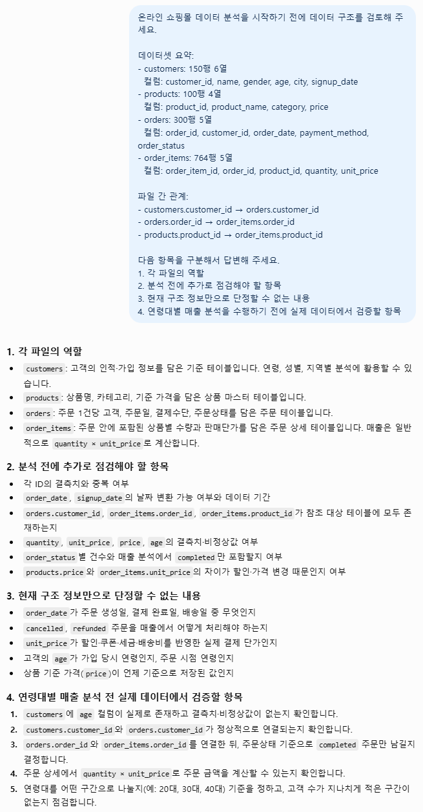

# Chapter 03 제출 답안 양식. 데이터의 첫인상 읽기

> 주 제출물은 실행 완료 Notebook `chapter03/chapter03.ipynb`입니다. 이 양식의 항목을 Notebook의 Markdown 셀로 추가해 작성합니다.

## 0. 제출 정보
- 이름: `이경석`
- GitHub ID: `leeks2026`
- 작성일: `260917`
- 최종 제출 URL:

## 1. 데이터 로딩과 구조 확인
### 실행/결과
- 4개 CSV 로딩 여부:
- 각 데이터 shape:
- 주요 컬럼:
- dtypes에서 주목한 컬럼:

### Evidence

### 결과 관찰
직접 확인한 사실을 작성하세요.

### 나의 해석과 판단
분석 전에 특히 주의해야 할 데이터셋/컬럼과 이유를 작성하세요.

### 업무·분석적 의미
구조를 먼저 확인하지 않고 분석을 시작할 때 생길 수 있는 문제를 작성하세요.

### 한계와 추가 확인 사항
아직 알 수 없는 품질 문제를 작성하세요.

## 2. 결측·중복·키 품질
- 주요 ID 결측:
- 주요 ID 중복:
- 전체 행 중복:

### 결과 관찰

### 나의 해석과 판단
어떤 문제를 먼저 처리해야 하는지 우선순위를 작성하세요.

### 업무·분석적 의미

### 한계와 추가 확인 사항

## 3. 숫자형·범주형·날짜 점검
- 숫자형 범위에서 주목한 값:
- 범주형 빈도에서 주목한 값:
- 날짜 변환 실패 건수:
- 날짜 범위:

### 결과 관찰

### 나의 해석과 판단
이상해 보이는 값이 실제 오류인지 업무적으로 가능한 값인지 구분하기 위해 무엇을 더 확인해야 하는지 작성하세요.

### 업무·분석적 의미

### 한계와 추가 확인 사항

## 4. CSV 간 키 관계 검증
- 없는 `customer_id`:
- 없는 `order_id`:
- 없는 `product_id`:

### 결과 관찰

### 나의 해석과 판단
키 관계 문제가 발견되었다면 바로 삭제하면 안 되는 이유를 작성하세요.

### 업무·분석적 의미

### 한계와 추가 확인 사항

## 5. LLM 구조 설명 검증
- LLM에 제공한 Safe Context:
- LLM이 제안한 추가 점검:
- 실제 데이터에서 확인한 항목:
- 채택/수정/보류한 내용:

### 나의 해석과 판단
LLM 제안 중 가장 유용했던 것과 가장 조심해야 할 것을 작성하세요.

### 한계와 추가 확인 사항

## 6. Chapter 03 최종 판단
### 데이터의 첫인상 3가지
1.
2.
3.

### 다음 Chapter 전에 반드시 확인/처리해야 할 항목
1.
2.
3.

### 현재 데이터만으로 단정할 수 없는 것

## 최종 제출 체크
- [ ] Notebook을 처음부터 끝까지 실행했습니다.
- [ ] 오류 셀이 남아 있지 않습니다.
- [ ] 핵심 Evidence를 첨부했습니다.
- [ ] 관찰과 해석을 구분했습니다.
- [ ] 개인정보/Secret이 없습니다.
- [ ] `chapter03/chapter03.ipynb`가 GitHub에서 정상 표시됩니다.
- [ ] 최종 Notebook 파일 URL을 제출합니다.