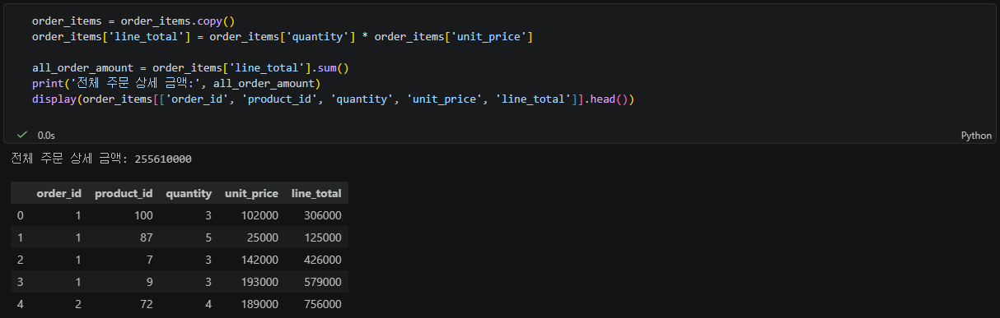
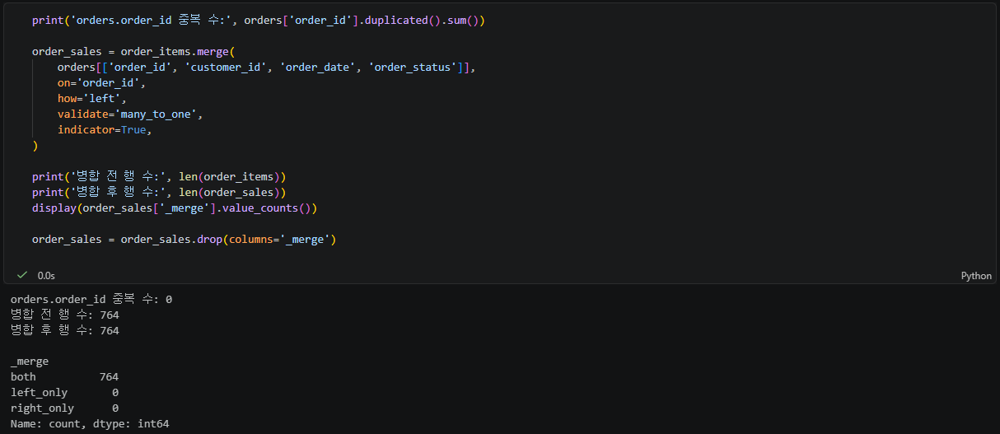
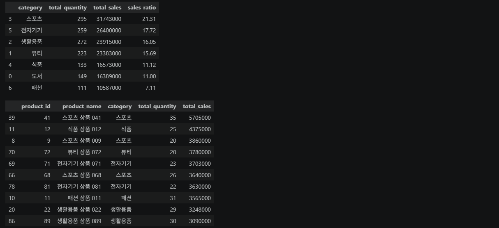
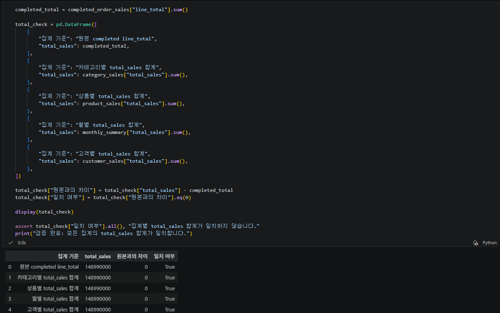
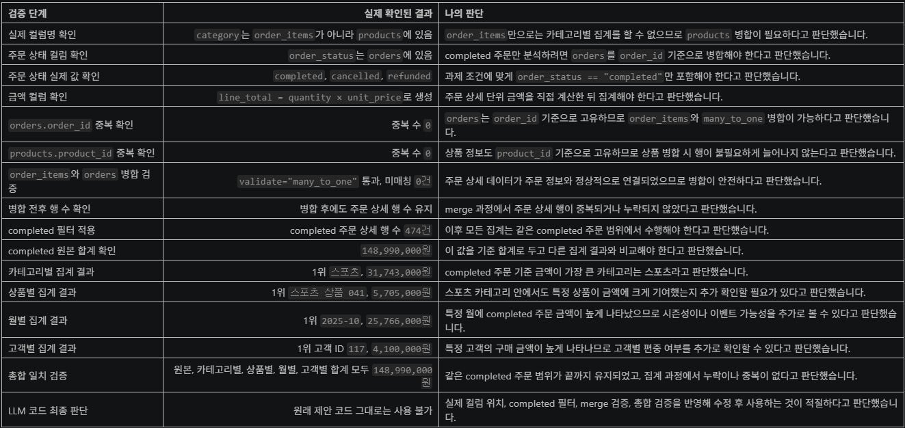

# Chapter 04 제출 답안 양식. pandas로 데이터에 질문하기

> 주 제출물은 실행 완료 Notebook `chapter04/chapter04.ipynb`입니다. 이 양식의 항목을 Notebook의 Markdown 셀로 추가해 작성합니다.

## 0. 제출 정보
- 이름: `이경석`
- GitHub ID: `leeks2026`
- 작성일: `20260928`
- 최종 제출 URL:

## 1. 질문과 필요한 데이터 선택
### 내가 확인하려는 질문
어떤 상품 카테고리의 completed 주문 기준 금액이 가장 큰가?

### 사용한 파일/컬럼
이번 분석의 질문에 맞춰 주문 상태, 주문 상세 금액, 상품 카테고리 정보를 함께 사용하였습니다.
사용한 파일과 주요 컬럼은 아래와 같습니다.

- `orders.csv`
  - `order_id`: 주문 상세 데이터와 병합하기 위한 주문 key
  - `customer_id`: 고객별 집계에 사용
  - `order_date`: 월별 집계를 위한 날짜 컬럼
  - `order_status`: 분석에 포함할 주문 상태를 구분하는 컬럼

- `order_items.csv`
  - `order_id`: 주문 데이터와 병합하기 위한 주문 key
  - `product_id`: 상품 데이터와 병합하기 위한 상품 key
  - `quantity`: 주문 수량
  - `unit_price`: 상품 단가
  - `line_total`: `quantity × unit_price`로 계산한 주문 상세 금액

- `products.csv`
  - `product_id`: 주문 상세 데이터와 병합하기 위한 상품 key
  - `product_name`: 상품별 집계에 사용
  - `category`: 최종 질문인 카테고리별 집계 기준

- `customers.csv`
  - `customer_id`: 주문 데이터와 병합하기 위한 고객 key
  - 고객 관련 컬럼: 고객별 구매 금액을 집계할 때 사용

분석에 포함한 주문 상태는 `order_status == "completed"`입니다.  
취소(`cancelled`) 또는 환불(`refunded`) 주문은 completed 주문 기준 금액을 왜곡할 수 있으므로 제외했습니다.

금액 계산식은 다음과 같습니다.
line_total = quantity × unit_price

### 결과 관찰
실제 데이터에서 `order_status` 값은 `completed`, `cancelled`, `refunded`로 확인되었습니다. 
이 중 completed 주문만 사용했을 때 주문 상세 기준 합계는 `148,990,000원`이었으며
카테고리별 집계 결과에서는 `스포츠` 카테고리의 `total_sales`가 `31,743,000원`으로 가장 컸습니다.

### 나의 해석과 판단
질문이 “completed 주문 기준 금액”을 묻고 있으므로, 취소되었거나 환불된 주문은 분석 범위에서 제외해야 한다고 판단했습니다. 
또한 상품 카테고리별 금액을 비교하려면 주문 상세의 수량과 단가, 상품의 카테고리 정보, 주문의 상태 정보가 모두 필요하므로 `order_items`, `orders`, `products` 데이터를 함께 사용했습니다.

### 업무·분석적 의미
completed 주문 기준으로 어떤 카테고리에서 금액 기여가 큰지 확인하면 재고 관리, 프로모션 기획, 카테고리별 매출 목표 설정에 활용할 수 있습니다. 
특히 금액이 큰 카테고리는 주요 매출원일 가능성이 있으므로 더 세부적인 상품 구성과 고객 특성을 추가로 분석할 가치가 있습니다.

### 한계와 추가 확인 사항
이번 분석의 `total_sales`는 `quantity * unit_price`의 합계이며, 실제 회사의 순매출이나 이익을 의미하지는 않습니다. 
할인, 쿠폰, 배송비, 반품 처리, 세금, 원가 정보가 반영되지 않았기 때문입니다. 
따라서 금액이 가장 큰 카테고리가 반드시 가장 수익성이 높거나 가장 인기 있는 카테고리라고 단정할 수는 없습니다.

## 2. 필터링·정렬·파생 컬럼
- 적용한 필터 조건: `order_status == "completed"`
- 정렬 기준: `total_sales` 기준 내림차순
- 만든 파생 컬럼: `line_total`
- `line_total` 계산식: `quantity * unit_price`

### 결과 관찰

### 나의 해석과 판단
필터 기준이 달라지면 결과가 어떻게 달라질지 작성하세요.

### 업무·분석적 의미

### 한계와 추가 확인 사항

## 3. merge 검증
- 병합한 데이터:
- 사용한 key:
- `validate` 결과:
- `indicator` 결과:
- 병합 전/후 행 수:

### 결과 관찰

### 나의 해석과 판단
이번 병합이 안전하다고 판단한 근거를 작성하세요. 행 수가 증가/감소했다면 이유를 설명하세요.

### 업무·분석적 의미
잘못된 merge가 분석 결과에 어떤 영향을 줄 수 있는지 작성하세요.

### 한계와 추가 확인 사항

## 4. completed 주문 범위와 집계
- 분석 범위 정의:
- 카테고리별 결과:
- 상품별 결과:
- 월별 결과:
- 고객별 결과:

### 결과 관찰
수치에서 직접 확인한 상위/하위 또는 변화 패턴을 작성하세요.

### 나의 해석과 판단
어떤 결과가 가장 중요하다고 판단했는지와 이유를 작성하세요.

### 업무·분석적 의미
다음 의사결정/분석으로 어떻게 연결할지 작성하세요.

### 한계와 추가 확인 사항
`total_sales`가 회계상 순매출과 같다고 단정할 수 없는 이유를 포함하세요.

## 5. 총합 일치 검증
- 원본 completed `line_total` 합계:
- 카테고리 합계:
- 월별 합계:
- 고객별 합계:
- 차이 여부:

### 나의 해석과 판단
총합 검증이 필요한 이유와 불일치 시 확인할 순서를 작성하세요.

## 6. LLM pandas 코드 검증
- LLM Prompt 요약:
- 제안 코드 요약:
- 실제 컬럼/범위와 맞지 않은 부분:
- 수정한 내용:
- 최종 판단: 사용 / 수정 후 사용 / 보류

### 나의 해석과 판단
LLM 코드가 실행되었다는 것만으로 분석이 맞다고 볼 수 없는 이유를 작성하세요.

## 7. Chapter 04 최종 인사이트
### 가장 의미 있다고 생각한 결과 2가지
1.
2.

### 그 결과를 뒷받침하는 수치/표

### 추가로 확인하고 싶은 질문

### 현재 결과의 한계

## 최종 제출 체크
- [ ] 핵심 셀 Output이 남아 있습니다.
- [ ] merge와 총합 검증 Evidence가 있습니다.
- [ ] 결과 관찰과 해석이 구분되어 있습니다.
- [ ] LLM 코드를 검증했습니다.
- [ ] 개인정보/Secret이 없습니다.
- [ ] `chapter04/chapter04.ipynb`가 GitHub에서 정상 표시됩니다.
- [ ] 최종 Notebook 파일 URL을 제출합니다.