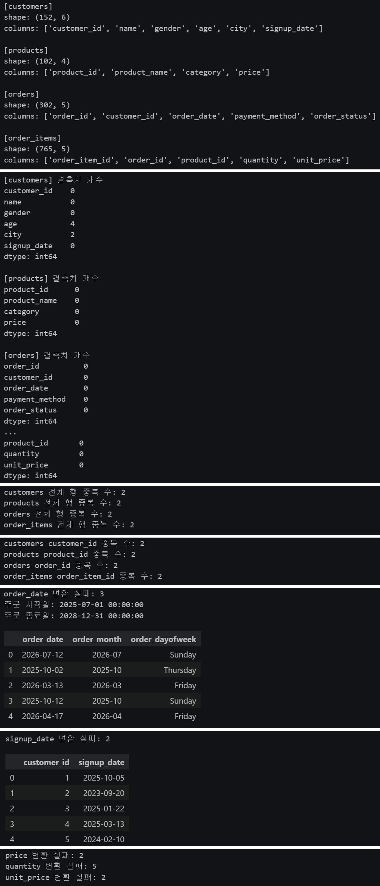
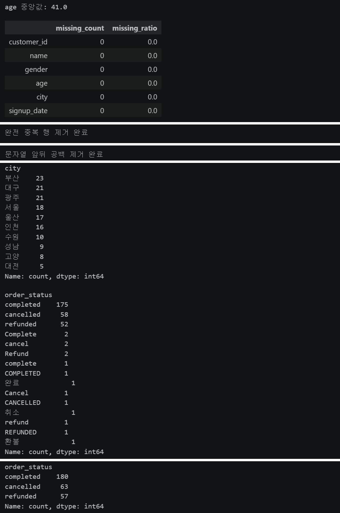
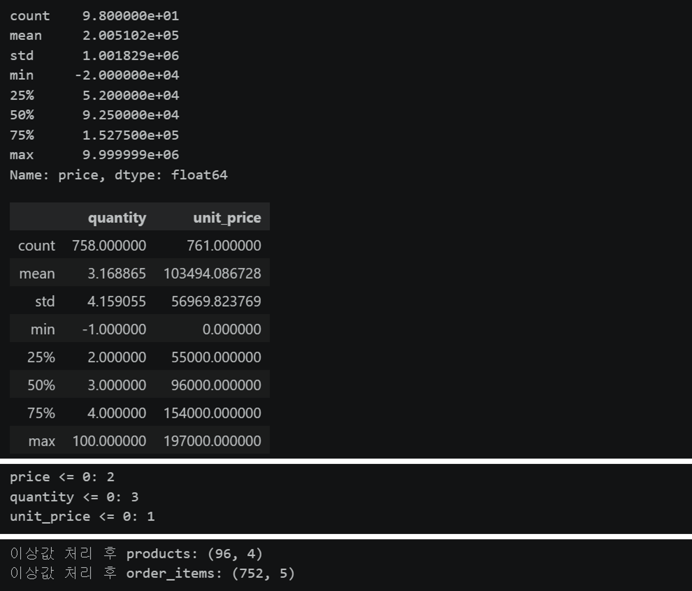
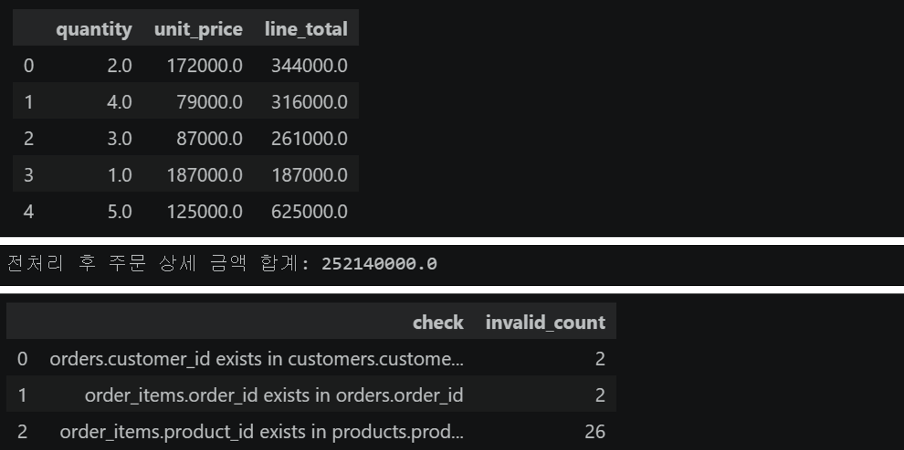
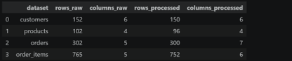
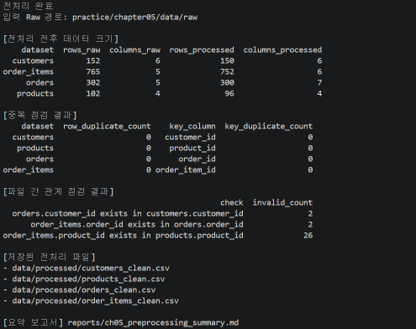

# Chapter 05 제출 답안 양식. 분석을 믿을 수 있게 만드는 데이터 전처리

> 주 제출물은 실행 완료 Notebook `chapter05/chapter05.ipynb`입니다. 이 양식의 항목을 Notebook Markdown 셀로 추가해 작성합니다.

## 0. 제출 정보
- 이름: `이경석`
- GitHub ID: `leeks2026`
- 작성일: `20261008`
- 최종 제출 URL: 미입력

## 1. 전처리 전 상태 기록
- 각 데이터 shape: customers (152, 6), products (102, 4), orders (302, 5), order_items (765, 5)
- 결측치: customers 6건(age 4, city 2); 나머지 세 파일 0건
- 전체 중복: 각 파일 2행씩, 합계 8행
- 주요 ID 중복: customer_id, product_id, order_id, order_item_id 각 2건
- 타입 문제 후보: signup_date와 order_date 날짜 문자열; price 변환 실패 2건; quantity 5건 및 unit_price 2건 변환 실패. 주문일 변환 실패 3건, 가입일 변환 실패 2건.



### 결과 관찰

customers 외 파일은 원본 결측이 없습니다. 네 파일 모두 완전 중복 행과 ID 중복이 2건씩 있습니다. 문자열처럼 저장된 날짜와 price/quantity/unit_price의 숫자 변환을 확인해야 합니다.

### 나의 해석과 판단

먼저 원본을 보존하고 중복 행과 키 중복의 원인을 구분합니다. 숫자·날짜 변환 실패를 따로 세어야 결측과 잘못된 표기를 구별할 수 있습니다.

### 업무·분석적 의미

나이 결측은 연령 분석에, 도시 결측은 지역 분석에 영향을 줍니다. 중복 ID는 고객·상품·주문 관계를 왜곡할 수 있고, 금액/수량 변환 실패는 매출 계산을 막을 수 있습니다.

### 한계와 추가 확인 사항

완전 중복이 반복 수집 오류인지 확인하고, 나이 150, 가격 9,999,999, 수량 50·100은 원천 기록과 대조해야 합니다.

## 2. 문자열·타입·결측 처리
- 적용한 문자열 정리: 문자열 앞뒤 공백 제거, 주문 상태 표기를 completed/cancelled/refunded로 통일
- 숫자 변환 대상과 실패 건수: products.price 2건; order_items.quantity 5건; order_items.unit_price 2건
- 날짜 변환 대상과 실패 건수: customers.signup_date 2건; orders.order_date 3건
- 결측 처리 기준: age 결측은 중앙값 41로 대체, city 결측은 `Unknown`; 변환 실패 날짜는 NaT로 남겨 원본 확인 대상으로 유지



### 결과 관찰

customers는 중앙값 대체 후에도 signup_date 2건이 결측입니다. orders는 order_date 변환 실패 3건과 이에 따른 order_month/order_dayofweek 결측이 각각 3건입니다.

### 나의 해석과 판단

중앙값은 나이의 극단값 영향을 줄이며, Unknown은 도시 누락 정보를 보존합니다. 하지만 날짜 변환 실패를 NaT로 바꾸면 원래 잘못된 문자열을 잃을 수 있으므로 원본 컬럼/행과 변환 실패 목록을 따로 보관해야 합니다.

### 업무·분석적 의미

결측 대체는 분석 대상 행을 보존하지만 분포를 바꿀 수 있습니다. 날짜 실패는 월별 추세에서 빠지므로 3건의 원인을 확인해야 합니다.

### 한계와 추가 확인 사항

age 중앙값 41은 이 데이터의 대표값일 뿐 모든 고객군에 적절하다고 단정할 수 없습니다. 도시 결측과 날짜/숫자 변환 실패의 수집 원인을 확인해야 합니다.

## 3. 중복·범주 표준화·이상값 후보
- 제거/보류한 중복: 네 파일에서 완전 중복 각각 2행 제거. 주요 ID 중복도 원본에서 각 2건 확인
- 표준화한 범주값: completed 180건, cancelled 63건, refunded 57건
- 허용값 밖 값: customers_clean에서 age 150인 고객 1명; price 0 이하 2행, quantity 0 이하 3행, unit_price 0 이하 1행은 해당 필터에서 제외
- 이상값 후보: product price 9,999,999; order item quantity 100 및 50; 날짜 2027-01/2028-12와 날짜 변환 실패 3건



### 결과 관찰

customers는 age 결측 중앙값 대체 뒤에도 150세 값이 남습니다. 9,999,999 가격과 수량 50·100은 분포상 눈에 띄는 후보입니다. `price > 0`, `quantity > 0`, `unit_price > 0` 처리로 0 이하 및 숫자 변환 실패 행이 제거됩니다.

### 나의 해석과 판단

이상값은 오류일 수도 있지만 고가 상품, 대량 주문, 반품/조정 거래일 수 있습니다. 삭제 전에 업무 정의와 원천 기록을 확인하고 제거된 행의 ID와 사유를 별도 저장해야 합니다.

### 업무·분석적 의미

현재 규칙을 그대로 적용하면 상품 4행과 주문 상세 일부가 제외되어 매출 및 관계 검사 결과에 영향을 줍니다. 취소·환불 상태는 완료 주문과 분리해 분석해야 합니다.

### 한계와 추가 확인 사항

양수 기준은 실습용 규칙이며 반품을 표현하는 음수 수량을 잘못 제외할 수 있습니다. 비정상적으로 먼 날짜와 고액 가격도 업무 담당자 확인이 필요합니다.

## 4. PK/FK와 파생 컬럼 재검증
- 없는 `customer_id`: orders에서 2건
- 없는 `order_id`: order_items에서 2건
- 없는 `product_id`: order_items에서 26건
- 생성한 파생 컬럼: order_month, order_dayofweek, line_total
- `line_total` 검증: quantity × unit_price; 필터 후 전체 합계 252,140,000



### 결과 관찰

제품 필터링 이후 order_items의 상품 참조 누락이 26건입니다. 주문 참조 및 고객 참조도 각각 2건씩 발견되어 관계 무결성이 유지되지 않습니다.

### 나의 해석과 판단

상품/주문 행 제거 후 참조 행이 남을 수 있으므로 PK/FK를 전처리 후 다시 확인해야 합니다. 잘못된 참조를 무조건 삭제하기보다 원본 ID가 누락된 이유를 조사하고 처리 기준을 정해야 합니다.

## 4-1. 24번 실습 과제 답안

### 과제 1. 결측치 비율 통합 표 요약
customers_clean에서는 signup_date 2/150건(1.33%) 결측입니다. orders_clean의 order_date, order_month, order_dayofweek는 각각 3/300건(1.00%) 결측입니다. 그 외 컬럼은 0%입니다. notebook 셀은 `missing_summary(df).reset_index()`를 사용해 전체 컬럼 표를 만듭니다.

### 과제 2. 나이 범위 확인
18세 미만은 0명, 100세 초과는 1명입니다. 해당 행은 customer_id 33, age 150입니다.

### 과제 3. 월별 주문 건수

| 월 | 건수 |
|---|---:|
| 2025-07 | 19 |
| 2025-08 | 26 |
| 2025-09 | 12 |
| 2025-10 | 22 |
| 2025-11 | 23 |
| 2025-12 | 23 |
| 2026-01 | 26 |
| 2026-02 | 19 |
| 2026-03 | 22 |
| 2026-04 | 26 |
| 2026-05 | 20 |
| 2026-06 | 24 |
| 2026-07 | 12 |
| 2026-08 | 21 |
| 2027-01 | 1 |
| 2028-12 | 1 |
| 날짜 결측 | 3 |

### 과제 4. line_total 상위 10개

| 순위 | 상세 ID | 주문 ID | 상품 ID | 수량 | 단가 | line_total |
|---:|---:|---:|---:|---:|---:|---:|
| 1 | 751 | 295 | 31 | 100 | 155,000 | 15,500,000 |
| 2 | 738 | 290 | 96 | 50 | 96,000 | 4,800,000 |
| 3 | 320 | 129 | 23 | 5 | 197,000 | 985,000 |
| 4 | 10 | 5 | 65 | 5 | 193,000 | 965,000 |
| 5 | 25 | 11 | 65 | 5 | 193,000 | 965,000 |
| 6 | 294 | 119 | 36 | 5 | 193,000 | 965,000 |
| 7 | 117 | 51 | 65 | 5 | 193,000 | 965,000 |
| 8 | 21 | 9 | 36 | 5 | 193,000 | 965,000 |
| 9 | 291 | 117 | 47 | 5 | 188,000 | 940,000 |
| 10 | 492 | 195 | 99 | 5 | 187,000 | 935,000 |

### 과제 5. 행 수 변화
customers 152→150, products 102→96, orders 302→300, order_items 765→752행입니다. 감소는 중복 제거와 가격/수량/단가 숫자 변환 실패 또는 양수 필터 때문입니다.

### 과제 6. LLM 검토 프롬프트

```text
전자상거래 데이터의 결측치 처리 기준을 검토해 주세요. 실제 고객명이나 주문 원문은 제공하지 않습니다.

요약:
- customers: age 결측 4건을 중앙값 41로 대체, city 결측 2건을 Unknown 처리, signup_date 변환 실패 2건
- products: price 변환 실패 2건과 0 이하 2건 제외; 최대값 9,999,999는 후보로 유지
- orders: order_date 변환 실패 3건
- order_items: quantity 변환 실패 5건, unit_price 변환 실패 2건; 양수 필터 적용
- 전처리 후 FK 위반: customer 2건, order 2건, product 26건

각 규칙의 정보 손실과 편향을 평가하고, 원본 행을 보존하면서 실패/제외 사유를 기록하는 방법, 담당자에게 확인할 질문, 재검증 지표를 제안해 주세요.
```

## 5. 전처리 전/후 비교
| 항목 | 처리 전 | 처리 후 | 변화 이유 |
| --- | ---: | ---: | --- |
| 전체 행 수 | 1,321 | 1,298 | 중복 제거 및 숫자 오류/0 이하 필터로 23행 감소 |
| 결측 | 6 | 11 | age/city는 대체했으나 signup_date 변환 실패 2건, 주문 날짜 및 파생 열 결측 9건 남음 |
| 완전 중복 행 | 8 | 0 | 각 파일 중복 2행 제거 |
| 주요 ID 중복 | 파일별 2 | 0 | 중복 행 제거 후 각 테이블 키 고유 |
| 변환 실패 | 숫자 9, 날짜 5 | 숫자 오류 행 제외, 날짜 결측 5 | 숫자 필터에서 행 제거, 잘못된 날짜는 NaT로 보존 |



### 결과 관찰

전체 행은 23개 감소하고, 원본 결측 6개 중 age/city 결측은 처리됐습니다. 날짜 변환 실패 5건은 결측 상태로 남고, 날짜 파생 열에도 6개 결측값이 추가되어 처리 후 결측 셀 합계는 11입니다.

### 나의 해석과 판단

행 감소는 중복 제거와 숫자/양수 규칙에 따른 결과입니다. 다만 제외 행에 실제 거래 의미가 있을 수 있으므로 원본과 제외 로그를 함께 보관해야 합니다. 숫자 변환 실패 9건은 quantity 5, unit_price 2, price 2를 합한 컬럼별 건수이며 행 수와 같은 개념은 아닙니다.

### 업무·분석적 의미

제외된 제품과 주문 상세가 매출 및 FK 지표를 낮추거나 참조 오류를 만들 수 있습니다. 현재 필터 후 product FK 오류가 26건이므로 이를 해결하기 전에는 상품별 매출 분석을 신뢰하기 어렵습니다.

### 한계와 추가 확인 사항

누락된 날짜를 임의 날짜로 채우지 않았고, 변환 실패 원문과 업무 사유를 확인해야 합니다. 취소/환불 처리, 가격 이상값, 관계 오류의 정정 기준도 데이터 소유자와 합의해야 합니다.

## 6. 재현 가능한 전처리 확인
- 생성된 clean CSV: `data/processed/customers_clean.csv` (150×6), `products_clean.csv` (96×4), `orders_clean.csv` (300×7), `order_items_clean.csv` (752×6)
- 생성된 요약 보고서: `reports/ch05_preprocessing_summary.md`
- `python scripts/preprocess_data.py` 재실행 결과: Codespaces에서 `전처리 완료`; 입력 경로는 `practice/chapter05/data/raw`
- 재실행 후 달라진 점: 행 수는 customers 152→150, products 102→96, orders 302→300, order_items 765→752로 감소했습니다. 처리 후 중복은 모두 0건이며, FK 점검에서 없는 customer_id 2건, order_id 2건, product_id 26건이 확인됐습니다.



### 나의 해석과 판단
전처리 스크립트를 재실행해 clean CSV 네 개와 요약 보고서가 생성되는 것을 확인했습니다. 따라서 전처리 과정을 다시 실행할 수 있음을 확인했습니다. 다만 파일 간 관계 점검에서 없는 customer_id 2건, order_id 2건, product_id 26건이 발견됐습니다. 이 참조 오류의 원인을 확인하고 처리 기준을 정한 뒤 관련 분석을 진행해야 합니다.

## 7. Chapter 05 최종 판단
### 내가 정한 전처리 원칙 3가지
1. raw 원본을 보존하고 복사본에서 처리합니다.
2. 삭제·대체는 업무 의미와 근거를 확인하고, 변경 건수와 사유를 기록합니다.
3. 전처리 뒤 행 수, PK/FK, 결측, 변환 실패, 파생값을 다시 점검합니다.

### 가장 위험하다고 생각한 자동 처리 1가지와 이유
0 이하 수량을 자동 제외하는 처리입니다. 음수 수량은 반품이나 재고 조정을 나타낼 수 있어 자동 삭제하면 매출과 거래가 왜곡될 수 있습니다.

### 다음 EDA에서 특히 주의할 데이터 특성
수량 50·100, 상품 가격 9,999,999, 날짜 변환 실패와 먼 미래 날짜, 취소·환불 상태를 확인합니다. 주문 300건과 주문 상세 752행을 구분해야 합니다. 관계 점검에서 없는 customer_id 2건, order_id 2건, product_id 26건이 발견됐으므로 상품별·고객별 분석 전에 원인을 확인해야 합니다.

### 현재 전처리의 한계
실습의 양수 필터는 반품 의미를 고려하지 않습니다. 날짜·숫자 변환 실패의 원문과 FK 누락의 원인을 아직 확인하지 않았습니다. Codespaces에서 스크립트 재실행과 clean CSV 및 요약 보고서 생성은 확인했지만, 관계 오류를 해결하지 않은 상태에서는 후속 분석 결과에 주의해야 합니다.

## 최종 제출 체크
- [x] raw 원본을 덮어쓰지 않았습니다.
- [x] 처리 전/후 비교를 남겼습니다.
- [x] 처리 기준과 이유를 작성했습니다.
- [x] clean CSV와 스크립트 재실행 결과를 확인했습니다.
- [x] 개인정보/Secret이 없습니다.
- [x] `chapter05/chapter05.ipynb`가 GitHub에서 정상 표시되는지 확인했습니다.
- [x] 최종 Notebook 파일 URL을 제출합니다.
